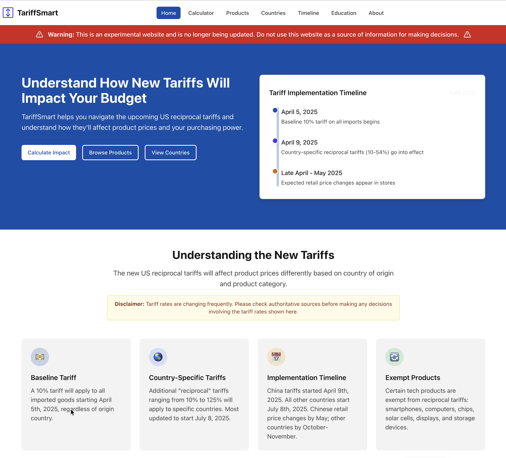

# TariffSmartIO

This project was the first in my "Adventures in Vibecoding" series - a collection of experiments and learning projects where I explore new tools, techniques, and workflows in software development. 

It was an experimental website and planned service (now out of date) for tracking and calculating tariff impacts on various product categories and countries.

The following screenshot provides a preview of what the website used to look like:



## Tech Stack

- **Frontend**: React (Vite)
- **Backend**: Express.js (Node.js)
- **Database**: PostgreSQL (Neon Serverless)
- **ORM**: Drizzle ORM
- **Styling**: Tailwind CSS & Radix UI

## Getting Started

### Prerequisites

- Node.js (v20+ recommended)
- npm

### Installation

1. Install dependencies:
   ```bash
   npm install
   ```

2. Push the database schema:
   ```bash
   npm run db:push
   ```

### Running Locally

- **Development**:
  ```bash
   npm run dev
   ```
- **Build**:
  ```bash
   npm run build
   ```
- **Start Production**:
  ```bash
   npm run start
   ```

## Documentation

- [CHANGELOG.md](./CHANGELOG.md) - Track security fixes and updates.
- [Walkthrough - Dependabot Alert Resolution](file:///Users/kapil/.gemini/antigravity/brain/1646f9fe-f01c-466a-b978-b890dcb50585/walkthrough.md) - Detailed report of the security patches applied in February 2026.
